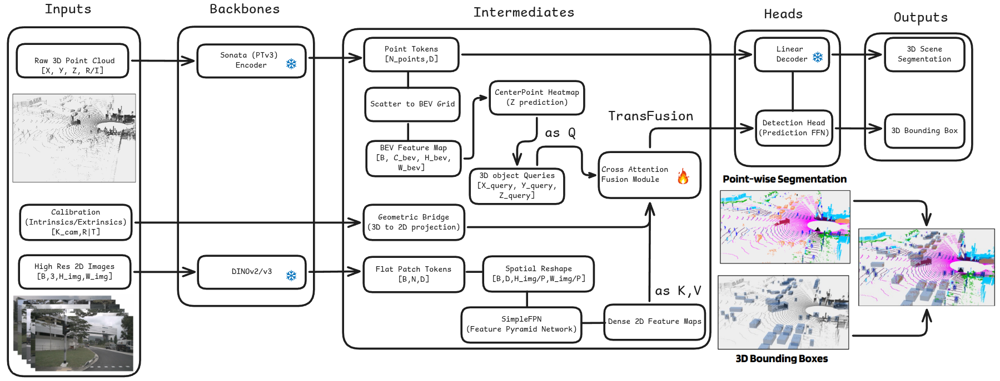
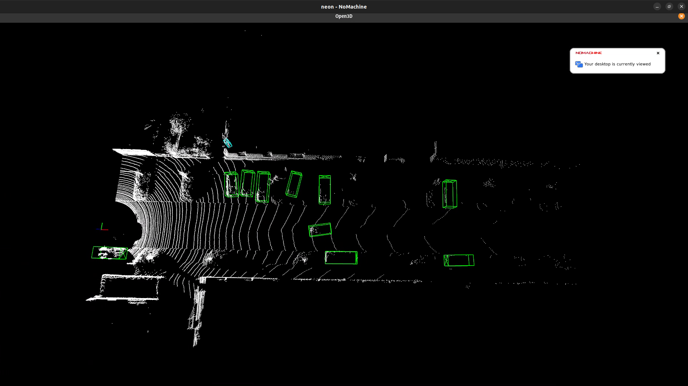

# SeeAnythingFar
Teaching Robots To See Far Away Obstacles!

The idea behind doing this was long range and sparse detection of 3D pointclouds to do long horizon
planning for autonomous vehicles, which have heavy mass or are moving at high speed, as they cannot
stop immediately, for which long horizon planning has to be done for which we need to detect, track
and segment faraway objects.

## Architecture 


| diagram block | code |
|---|---|
| Sonata (PTv3) encoder, point tokens, scatter to BEV grid | `src/seeanythingfar/models/backbone_3d/sonata.py` |
| DINOv3, flat patch tokens, spatial reshape, SimpleFPN | `src/seeanythingfar/models/backbone_2d/dino_fpn.py` |
| CenterPoint heatmap (Z prediction), 3D object queries, cross attention fusion, detection FFN | `src/seeanythingfar/models/fusion_heads/transfusion.py` |
| Geometric bridge (3D to 2D projection) | `src/seeanythingfar/utils/geometry.py` |
| Linear decoder (point-wise segmentation) | `src/seeanythingfar/models/seg_heads/linear.py` |
| everything wired together | `src/seeanythingfar/models/detector.py` |

## Quickstart
```bash
uv pip install -e ".[dev,nuscenes]"
pytest                                        # CPU, no data or downloads needed
python train.py --config-name config           # GPU

# nuScenes
python tools/create_nuscenes_infos.py --data-root $NUSCENES_ROOT --out-dir $NUSCENES_ROOT --max-sweeps 10
NUSCENES_ROOT=/path/to/nuscenes python train.py
python eval.py +ckpt=outputs/<run>/checkpoints/last.ckpt
python eval.py +ckpt=... system.nuscenes_export=results/nusc.json +official=true   # devkit mAP / NDS
python visualize.py +ckpt=... +index=0 +out=viz
```
The real 3D backbone needs the `sonata` package (follow the install instructions at
https://github.com/facebookresearch/sonata: spconv, torch_scatter, optionally flash-attn).
Without it, `model/backbone_3d=mlp` runs a per-point MLP stand-in, which is for testing only.

## Slurm
- added local cuda setup for version 12.8 for compatibility
- code is in `slurm/neon/cuda_setup.sh`

## OpenPCDet
- currently I have used it as a backbone
- try to install openmmlab environment from their official website
```bash
# some additional dependency
conda activate openmmlab
pip install spconv-cu120

# for visualizations
pip install open3d
```
- setup the repo using
```
cd /src/seeanythingfar/openPCDet/
python3 setup.py develop
```

## Pretained weights
- currently used `pv_rcnn` weights for 3D object detection for far distance from [link](https://drive.google.com/file/d/1lIOq4Hxr0W3qsX83ilQv0nk1Cls6KAr-/view?usp=sharing)
- a copy of the orginal semantic-kitti dataset is there on the neon server
```python3
python3 demo.py \ 
--cfg_file cfgs/kitti_models/pv_rcnn.yaml \ 
--ckpt pv_rcnn_8369.pth \
--data_path /scratch/soumo_roy/semantic-kitty-dataset/dataset/sequences/00/velodyne/000000.bin 
```


## Slide Deck
- I am attaching the slide deck of the experiments done [link](https://docs.google.com/presentation/d/13FvgcBmLo90PO2pVOTtf5GvFLkXOykHQLE2QgfY7nAM/edit?usp=sharing)

## Environment setup
```
uv pip install -e .
source .venv/bin/activate
```